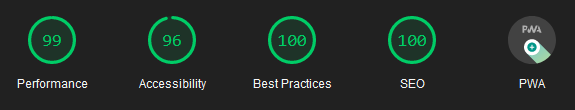
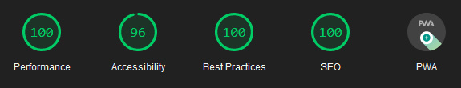

# Eleventy Material
Eleventy Material is a very opiniated blogging theme for Eleventy, built with the [MDUI framework](https://github.com/zdhxiong/mdui) and written by a newbie that have no idea how to write a good code 👌😳👌.

# [Live Demo](https://eleventy-material.netlify.app/)

## Mobile score 😮


## Desktop score 😍


# Features
I'm not sure what would you expect from this theme but I'll try to list anything I can remember 😳:
- Material Design 2 theme 😊
- Dark mode toggle (enabled by default) using localStorage API 😎
- Post sharing buttons that I copied from YouTube 😝
- Generate a QR code to read the post on other devices 👍
- Opengraph tags for social media sharing 👍
- Images are lazily loaded by default (if you use the `````` shortcode) 😌
- Almost perfect 100 score on LightHouse on both Desktop and Mobile test 👌😌👌
- Static assets are cached for 6 months (configurable through ```_headers``` and ```_headers.njk```) 😮

# How to use
1. Install Git
2. Install NodeJS
3. Clone this repo
4. Run ```npm run build```
5. Profit(n't) 👌😌👌

Available commands:
- ```npm run dev``` - to start the development server
- ```npm run build``` - to build the site

That's just it 👍

---

You can use the theme as-is, but please take a look into the /data/ folder first and make a bit of changes here and there.  
Change the `url` variable to your blog's actual site.  
You might also want to change something in the `.manifest` file.

To write an article/post, put them inside the /posts/ folder.

# TO DO (or not to do... no promise ✌️😁✌️)
- Add search functionality 🫢 (help needed)
- Add Disqus
- Add workbox for generating the service-worker (if it's ever needed...)
- Add a bit of an animation .onload()?
- Add Web Share API to post sharing button
- Docs on how to actually use the theme and how to write a post
